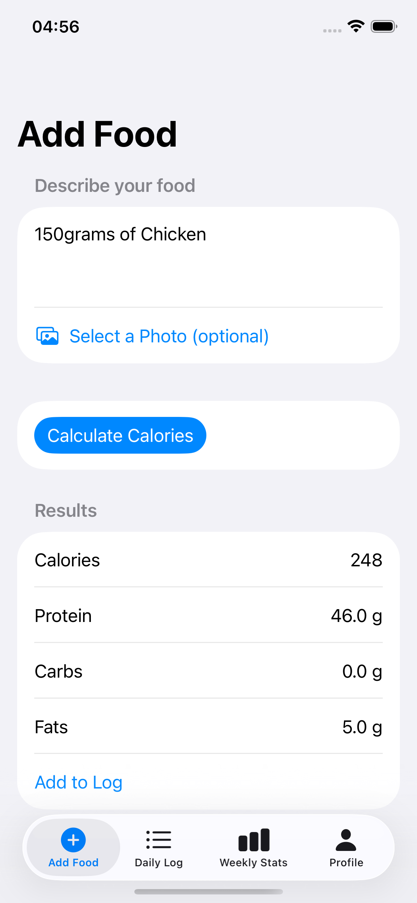
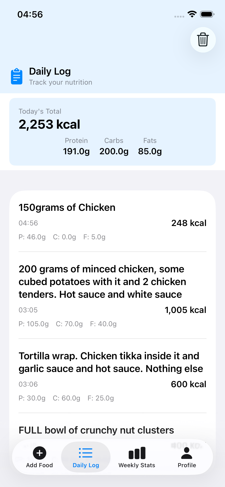
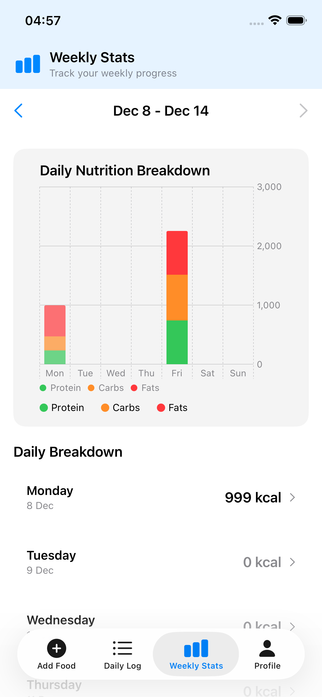
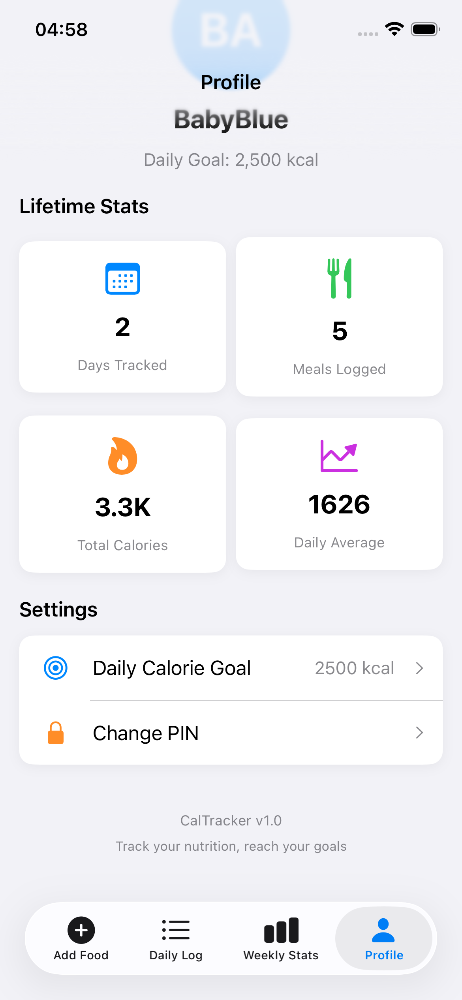
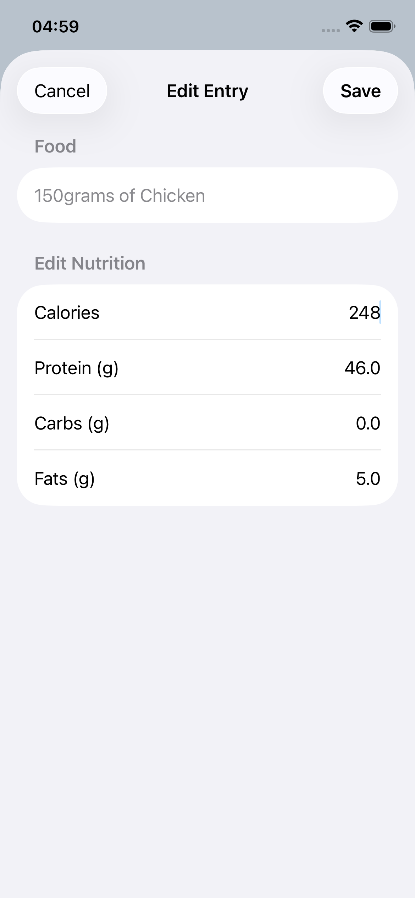
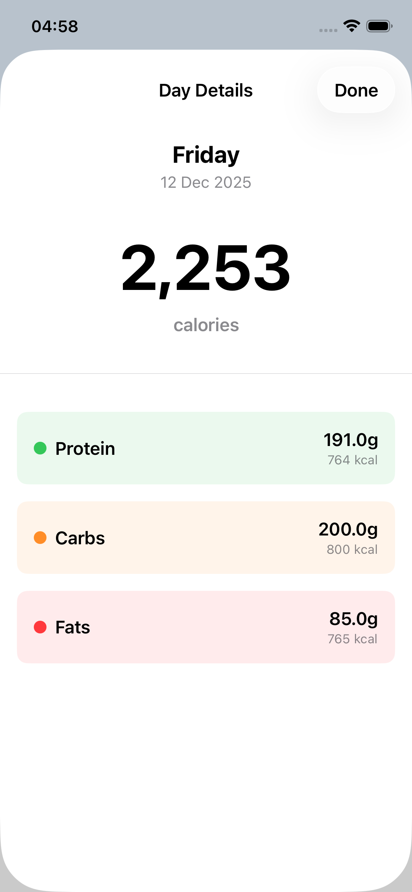

# CalTracker-Sho
AI powered calorie tracking app build in swift - Sho
## Setup Instructions

1. Clone this repository
2. Rename `Config.swift.example` to `Config.swift`
3. Open `CalTracker.xcodeproj` in Xcode
4. Build and run

## License

© 2025 Sho (Shoaib). All Rights Reserved.
Proprietary software - unauthorized use prohibited.

---

## Screenshots

  
  
  
  

  
  

---

## Features

- **AI-Powered Calorie Estimation** - Uses OpenAI GPT-4o-mini for accurate food analysis
- **Photo Recognition** - Upload food photos for better portion estimation
- **Secure PIN Authentication** - Local-only authentication, no cloud storage
- **Daily & Weekly Tracking** - Beautiful charts showing macro breakdown
- **Personalized Goals** - Set and track custom calorie targets
- **Macro Tracking** - Detailed protein, carbs, and fats breakdown
- **UK Food Database** - Optimized for UK portion sizes and brands

---

## Tech Stack

- **Language:** Swift 6
- **Framework:** SwiftUI
- **Storage:** SwiftData (local)
- **AI:** OpenAI API
- **Platform:** iOS 18+
- **Architecture:** MVVM

---

## Design Highlights

- Clean, modern iOS design language
- Stacked bar charts with macro color-coding
- Smooth navigation with tab bar interface
- Editable entries with tap-to-edit functionality
- Compact headers to maximize content visibility

---

## Privacy & Security

- ✅ All data stored locally on device
- ✅ PIN-protected authentication
- ✅ No user data sent to external servers (except food descriptions to OpenAI API)
- ✅ API calls are minimal and text-only (photos processed locally then sent as base64)

---

## License

**© 2024 Sho (Shoaib). All Rights Reserved.**

This software is proprietary and confidential.  
Unauthorized copying, distribution, or modification is strictly prohibited.

---

## Author

**Sho (Shoaib)**  

---

## Development Timeline

- **December 8, 2024:** Project started
- **December 12, 2024:** v1.0.0 released

---

   by sho - babyblue

